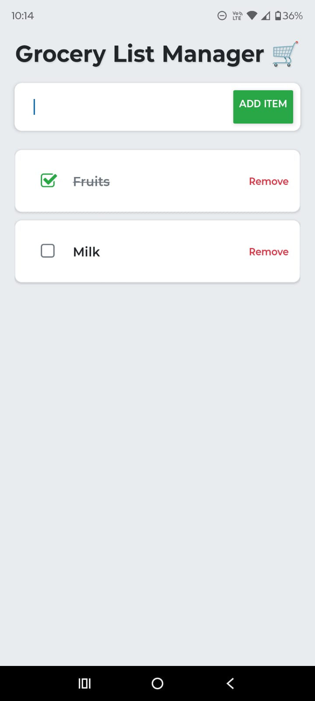

# INFO670
Assignments and resources for INFO670 - Cross-platform Mobile Development

# Grocery List Manager
React Native app to manage grocery lists.

**Grocery List Manager** helps users organize their grocery shopping by adding items, marking them as complete, and removing them.

## Basic Use
1. **Add an Item**:
   - Enter an item (e.g., "Milk") in the input field.
   - Press the "Add Item" button.
   - Empty inputs trigger an error alert.

2. **Mark as Complete**:
   - Tap the checkbox to mark an item as done (strikethrough applied).
   - Tap again to unmark.

3. **Remove an Item**:
   - Tap "Remove" to delete an item.

4. **View the List**:
   - Scroll through the list of items.

## Screenshots
1. **Empty List**:
   
2. **Adding an Item**:
   
3. **List with Marked Items**:
   
3. **Empty input Error**:
   
