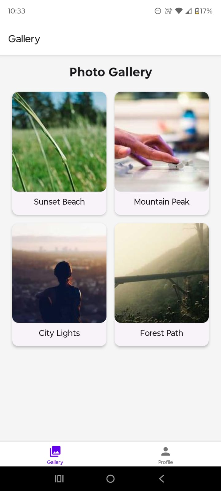
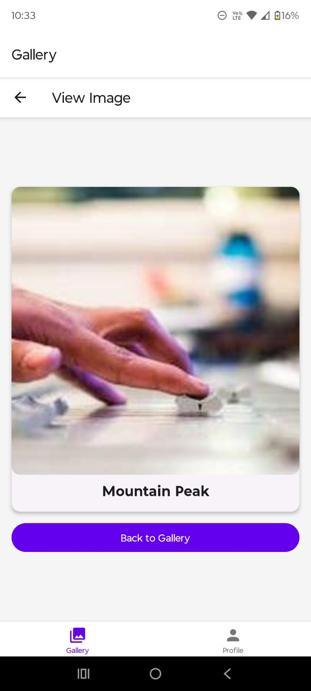
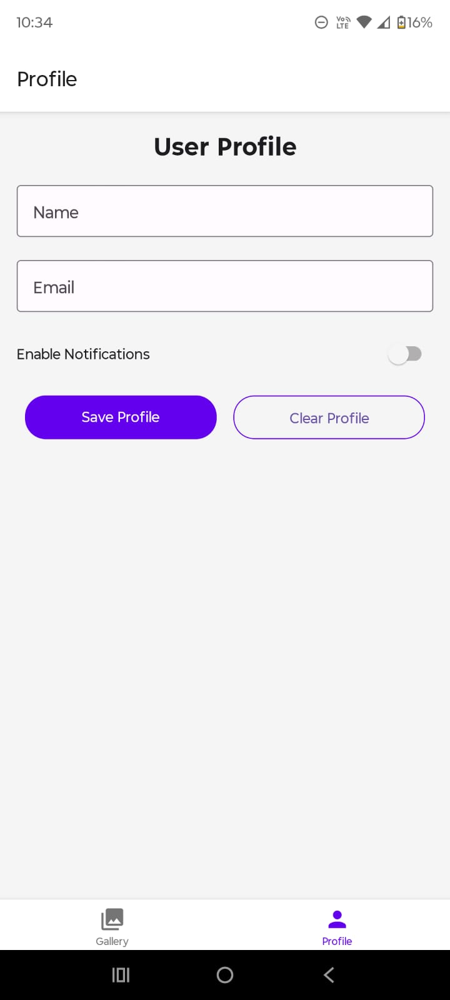
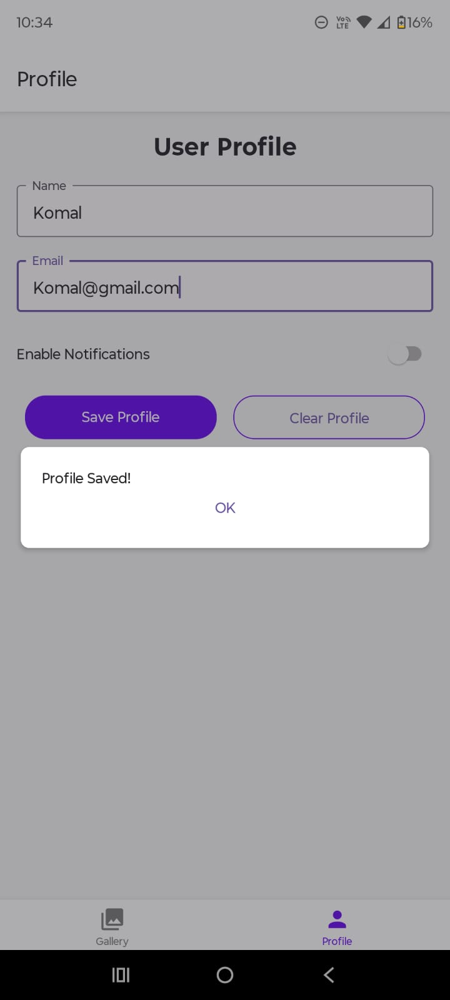

# Photo Gallery App
A React Native app for browsing images and managing user profiles.

## Design and Purpose
Photo Gallery App allows users to view a gallery of images, see full-size images with captions, and edit a personal profile with persistent data.

## Target Audience
Users interested in viewing images and maintaining personal profile data.

## Basic Use

1. **Gallery Screen**:
   - View a grid of image thumbnails with captions.
   - Tap an image to navigate to the Picture Viewer screen.

2. **Picture Viewer Screen**:
   - View the full-size image and its caption.
   - Press "Back to Gallery" to return.

3. **Profile Screen**:
   - Enter name, email, and toggle notifications.
   - Press "Save Profile" to store data.
   - Press "Clear Profile" to remove stored data and reset fields.
   - Empty fields trigger an error modal.
   - Saved data persists across app restarts.

## Screenshots

1. **Gallery Screen**:
   

2. **Picture Viewer Screen**:
   

3. **Profile Screen**:
   

4. **Profile Saved Screen**:
   