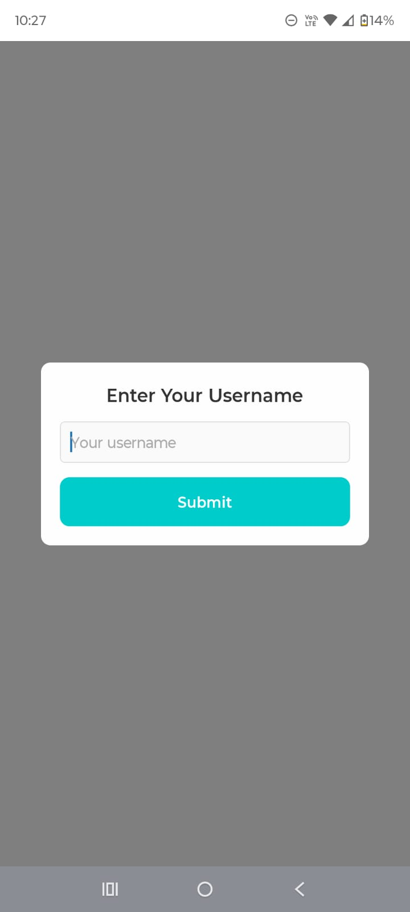
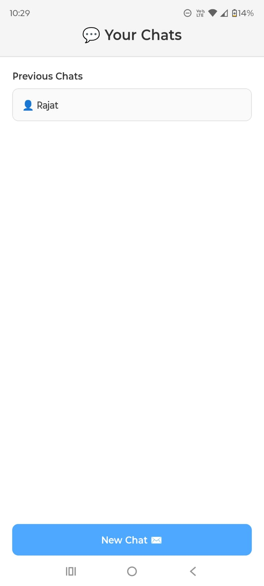
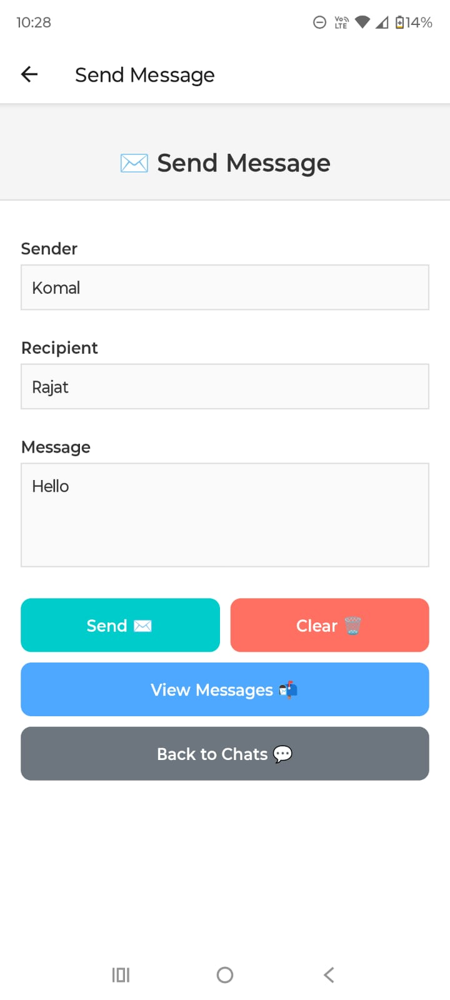
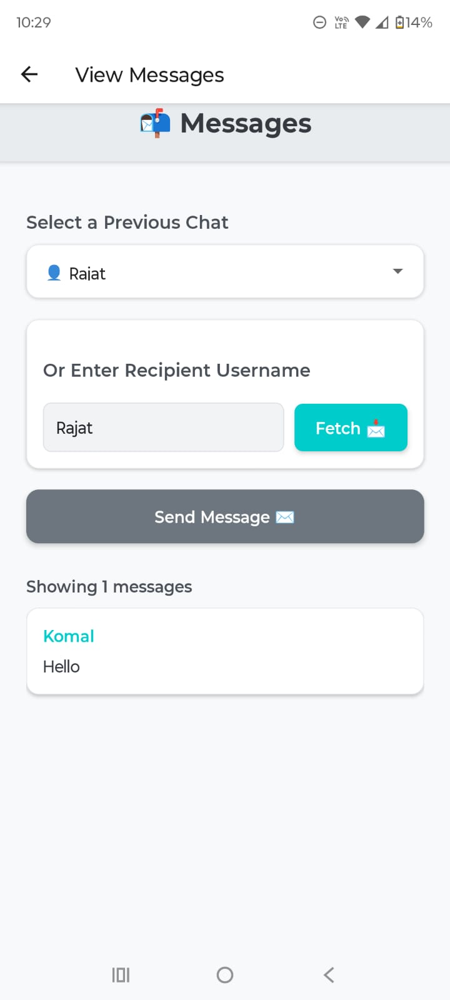

# 📨 Messenger App

A React Native app for sending and viewing messages between users.

---

## Design and Purpose

Messenger App allows users to send messages to other users, view previous chats, and manage conversations using a MySQL database for persistent storage.

---

## Target Audience

Users interested in messaging and maintaining chat history.

---

## Setup Instructions

---

### Install Dependencies

#### Frontend:

```bash
cd frontend
npm i
```

#### Backend:

```bash
cd server
npm i
```

---

### Configure the Database

Copy and paste the following SQL into your MySQL client (e.g., MySQL Workbench or CLI):

```sql
CREATE DATABASE IF NOT EXISTS messenger_db;
USE messenger_db;

CREATE TABLE IF NOT EXISTS messages (
  id INT AUTO_INCREMENT PRIMARY KEY,
  sender VARCHAR(255) NOT NULL,
  recipient VARCHAR(255) NOT NULL,
  message TEXT NOT NULL,
  created_at DATETIME NOT NULL
);
```

In the `server/` directory, update the `.env` file with your MySQL credentials:

```env
DB_HOST=localhost
DB_USER=root
DB_PASSWORD=your_mysql_password
DB_NAME=messenger_db
```


---

### Configure the Backend URL

1. Find your laptop’s IPv4 address:

   - Open Command Prompt (Windows) by typing `cmd` in the search bar.
   - Run:

     ```bash
     ipconfig
     ```

   - Look for the **IPv4 Address** under your active network connection (e.g., `192.168.1.5`).

2. In the `frontend/` directory, update the `.env` file:

```env
BACKEND_URL=http://your_ipv4_address:3000
```

> Replace `your_ipv4_address` with your actual IPv4 address (e.g., `http://192.168.1.5:3000`).

---

## Run the Application

### Start the Server:

```bash
cd server
npm start
```

Expected output:

```
Connected to MySQL database  
Server running on port 3000
```

---

### Start the Frontend:

```bash
cd frontend
npx expo start
```

- Scan the QR code using the **Expo Go** app on your mobile device.
- If using a physical device on the same network, ensure you’re using the **LAN URL**.
- If LAN doesn’t work, use the **Tunnel URL**.

---

## Basic Use

### Home Screen:

- Enter your username when prompted.

   

- View a list of previous chats (if any).
- Press **"New Chat"** to start a new conversation.

   

---

### Sender Screen:

- Enter the recipient’s username and message.
- Press **"Send"** to send the message.
- Press **"View Messages"** to see conversations.
- Press **"Back to Chats"** to return to the Home Screen.

   

---

### Receiver Screen:

- Select a previous chat or enter a recipient’s username manually.
- Press **"Fetch"** to view messages.
- Messages display with sender, timestamp, and content.
- Press **"Send Message"** to return to the Sender Screen.

   

---

### Update Server .env:

```env
DB_HOST=bvm25.cci.drexel.edu
DB_USER=your_cci_username
DB_PASSWORD=your_cci_password
DB_NAME=messenger_db
PORT=3000
```

---

### Update Frontend .env:

```env
BACKEND_URL=http://tux.cs.drexel.edu:3000
```

---

## Troubleshooting

### Frontend Not Connecting to Backend:

- Ensure the `BACKEND_URL` in `frontend/.env` matches your server’s IP and port.
- Verify the server is running (`npm start` in the server/ directory).
- Check your network: Both devices (phone and laptop) should be on the same Wi-Fi.

---

## Project Structure

### Frontend:

`frontend/`: Contains the React Native (Expo) frontend code.

- `HomeScreen.js`: Displays previous chats and allows starting a new chat.
- `SenderScreen.js`: Interface to send messages.
- `ReceiverScreen.js`: Interface to view messages.

---

### Server:

`server/`: Contains the Node.js backend code.

- `server.js`: Express server with API endpoints (`/getRecipients`, `/sendMessage`, `/retrieveMessages`).


